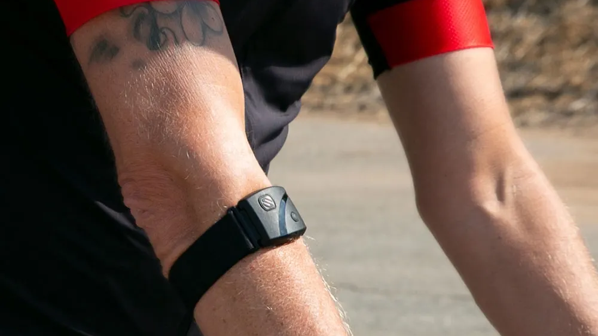

# HRM Watch

- Author:  [Sébastien Mosser](mossers@mcmaster.ca)
- Version: 2024.09


## Rationale 

This python script simulates an _Heart Rate Monitor_ (HRM) like the one on the picture, or any smart watch of chest monitor that can be used to continuously measure your heart rate _beats per minute_ (bpm) value. This is useful for athletes to  track their performances.



<div align="center">
    <small>Source: <a href="https://www.pcmag.com/picks/the-best-heart-rate-monitors">PC Mag </a> (Credit: Scosche) </small>
</div>


We're using [MQTT](https://en.wikipedia.org/wiki/MQTT) to exchange message between the watch and a receiver (e.g., the athlete's smartphone, a bluetooth receiver in a gym studio). This protocol is standard when working with elements with limited hardware capacity in an _Internet of Things_ (IoT) context.

The simulator uses a data format which is a subset of [SenML](https://datatracker.ietf.org/doc/rfc8428/), the IETF standard for sensor data (RFC 8428). 

## Usage

The script simulates one of this device. It requires an identifier (the serial number of the device we're simulating), and the location of the receiver (simulated by an MQTT message queue).

```
$ pipenv shell
(pipenv) $ ./hrm_watch.py --help
```

