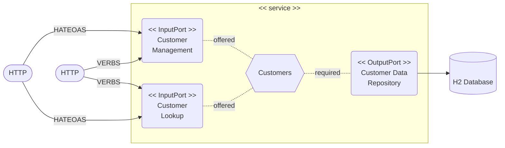

# Customer Service

- Author: Sébastien Mosser
- Version 2024.09

## Rationale

This service acts as the national customer registry.

## Technologies

- Java 21 (LTS)
- Spring Boot 3.3.2
- Swagger (OpenAPI Documentation)
- JPA (Persistence)
- H2 (Database)

## Architecture

### Service Description



### Service Model

TBD

## How to use locally

### Operating the service 

To compile the service registry on your computer:

```
hrm_receiver $ mvn clean package
```

To start the service registry locally:

```
hrm_receiver $ mvn spring-boot:run -Dspring-boot.run.profiles=local
```

When ran locally, the service assumes the infrastructure is up and running on `localhost`.

### REST Interface

The service exposes its feature using REST interfaces. We expose two different levels of interface:

- Paths prefixed by `verbs` demonstrate APIs designed at level 3 of [Richardson maturity model](https://en.wikipedia.org/wiki/Richardson_Maturity_Model);
- Paths prefixed by `hateoas` demonstrate APIs designed at level 4 of [Richardson maturity model](https://en.wikipedia.org/wiki/Richardson_Maturity_Model).

All interfaces are exposed using Swagger:

- Web UI: [http://localhost:9090/swagger-ui.html](http://localhost:9090/swagger-ui.html)
- API Contract: [http://localhost:9090/v3/api-docs](http://localhost:9090/v3/api-docs)

### Internal database

The internal database is accessible using the internal H2 web console:

- [http://localhost:9090/h2-console](http://localhost:9090/h2-console)