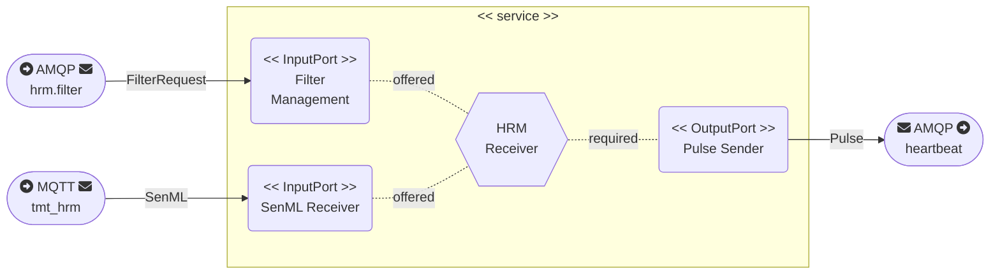
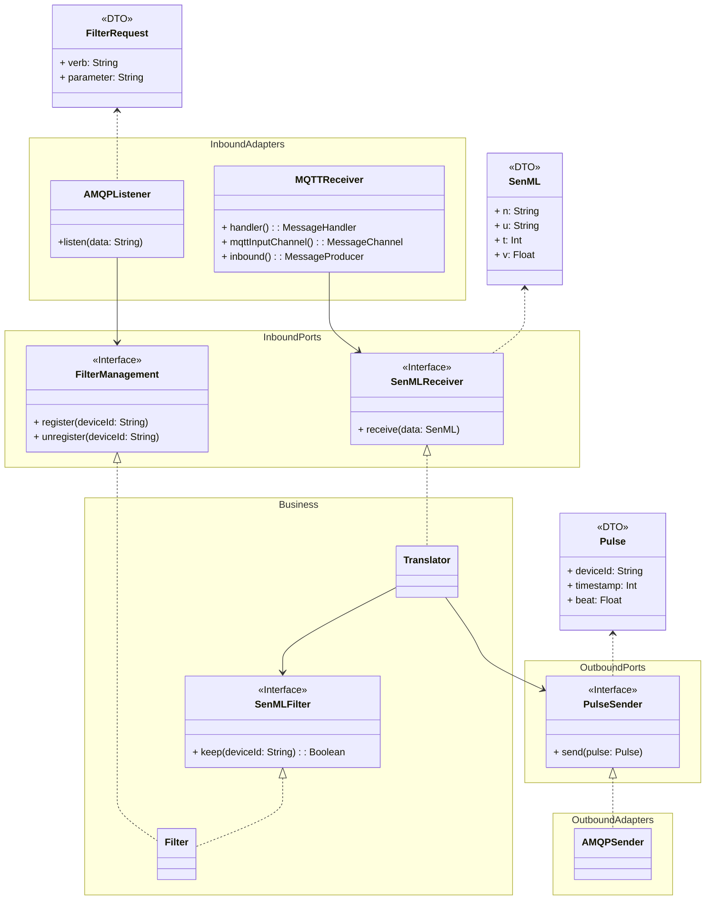

# HRM Receiver

- Author: Sébastien Mosser
- Version 2024.09

## Rationale

This service acts as the radio receiver deployed in a given studio to collect the messages sent by the HRMs held by participants. It receives the raw data sent by registered heart rates monitors (using MQTT), and pushes them into the TMT system (using a regular AMQP queue).


## Technologies

- Java 21 (LTS)
- Spring Boot 3.3.2
- RabbitMQ (AMQP and MQTT)

## Architecture

### Service Description



### Service Model



## How to use locally

### Operating the service 

To compile the service registry on your computer:

```
hrm_receiver $ mvn clean package
```

To start the service registry locally:

```
hrm_receiver $ mvn spring-boot:run -Dspring-boot.run.profiles=local
```

When ran locally, the service assumes the infrastructure is up and running on `localhost`.

### Example of messages to send

- Use the `hrm_client` program to simulate multiple HRM sending datas
- Filtering requests to be sent to the `hrm.filter` exchange:
  - To register a device identified as `foo`: `{ "verb": "register", "parameter": "foo" }`   
  - To unregister a device identified as `foo`: `{ "verb": "unregister", "parameter": "foo" }`   
  - To flush all registrations: `{ "verb": "flush", "parameter": "" }`   